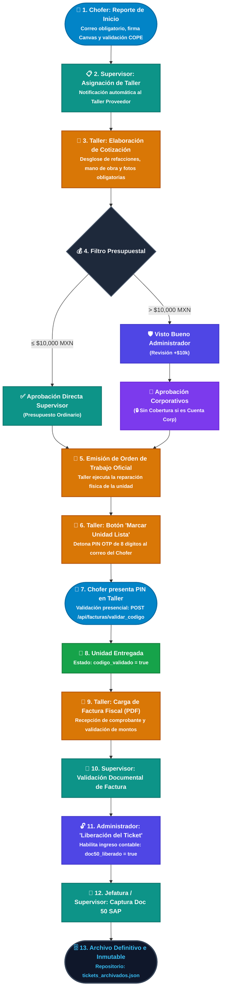

```mermaid
flowchart TD
    %% Definición de Estilos por Rol / Fase
    classDef chofer fill:#0284c7,stroke:#0369a1,stroke-width:2px,color:#ffffff,font-weight:bold;
    classDef supervisor fill:#0d9488,stroke:#0f766e,stroke-width:2px,color:#ffffff,font-weight:bold;
    classDef taller fill:#d97706,stroke:#b45309,stroke-width:2px,color:#ffffff,font-weight:bold;
    classDef admin fill:#4f46e5,stroke:#4338ca,stroke-width:2px,color:#ffffff,font-weight:bold;
    classDef corp fill:#7c3aed,stroke:#6d28d9,stroke-width:2px,color:#ffffff,font-weight:bold;
    classDef condicion fill:#1e293b,stroke:#475569,stroke-width:2px,color:#f8fafc,font-weight:bold;
    classDef exito fill:#16a34a,stroke:#15803d,stroke-width:2px,color:#ffffff,font-weight:bold;
    classDef cierre fill:#0f172a,stroke:#334155,stroke-width:3px,color:#38bdf8,font-weight:bold;

    %% Nodos del Flujo
    A(["🚗 1. Chofer: Reporte de Inicio<br/><small>Correo obligatorio, firma Canvas y validación COPE</small>"]):::chofer
    B["📋 2. Supervisor: Asignación de Taller<br/><small>Notificación automática al Taller Proveedor</small>"]:::supervisor
    C["🔧 3. Taller: Elaboración de Cotización<br/><small>Desglose de refacciones, mano de obra y fotos obligatorias</small>"]:::taller
    
    D{"💰 4. Filtro Presupuestal"}:::condicion
    
    E1["✅ Aprobación Directa Supervisor<br/><small>(Presupuesto Ordinario)</small>"]:::supervisor
    E2["🛡️ Visto Bueno Administrador<br/><small>(Revisión +$10k)</small>"]:::admin
    E3["🏢 Aprobación Corporativos<br/><small>(🔒 Sin Cobertura si es Cuenta Corp)</small>"]:::corp
    
    F["📄 5. Emisión de Orden de Trabajo Oficial<br/><small>Taller ejecuta la reparación física de la unidad</small>"]:::taller
    G["🔔 6. Taller: Botón 'Marcar Unidad Lista'<br/><small>Detona PIN OTP de 8 dígitos al correo del Chofer</small>"]:::taller
    H(["🔐 7. Chofer presenta PIN en Taller<br/><small>Validación presencial: POST /api/facturas/validar_codigo</small>"]):::chofer
    I["🚙 8. Unidad Entregada<br/><small>Estado: codigo_validado = true</small>"]:::exito
    J["📑 9. Taller: Carga de Factura Fiscal (PDF)<br/><small>Recepción de comprobante y validación de montos</small>"]:::taller
    K["🔎 10. Supervisor: Validación Documental de Factura"]:::supervisor
    L["🔓 11. Administrador: 'Liberación del Ticket'<br/><small>Habilita ingreso contable: doc50_liberado = true</small>"]:::admin
    M["💼 12. Jefatura / Supervisor: Captura Doc 50 SAP"]:::supervisor
    N(["🗄️ 13. Archivo Definitivo e Inmutable<br/><small>Repositorio: tickets_archivados.json</small>"]):::cierre

    %% Conexiones
    A --> B
    B --> C
    C --> D
    
    D -- "≤ $10,000 MXN" --> E1
    D -- "> $10,000 MXN" --> E2
    E2 --> E3
    
    E1 --> F
    E3 --> F
    
    F --> G
    G --> H
    H --> I
    I --> J
    J --> K
    K --> L
    L --> M
    M --> N
```
