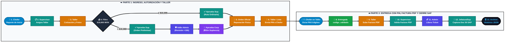

```mermaid
%%{init: {'themeVariables': {'lineColor': '#000000'}}}%%
flowchart LR
    %% Definición de Estilos por Rol / Fase (Con mayor tamaño y fuente)
    classDef chofer fill:#0284c7,stroke:#0369a1,stroke-width:3px,color:#ffffff,font-weight:bold,font-size:15px;
    classDef supervisor fill:#0d9488,stroke:#0f766e,stroke-width:3px,color:#ffffff,font-weight:bold,font-size:15px;
    classDef taller fill:#d97706,stroke:#b45309,stroke-width:3px,color:#ffffff,font-weight:bold,font-size:15px;
    classDef admin fill:#4f46e5,stroke:#4338ca,stroke-width:3px,color:#ffffff,font-weight:bold,font-size:15px;
    classDef corp fill:#7c3aed,stroke:#6d28d9,stroke-width:3px,color:#ffffff,font-weight:bold,font-size:15px;
    classDef condicion fill:#1e293b,stroke:#000000,stroke-width:3px,color:#f8fafc,font-weight:bold,font-size:15px;
    classDef exito fill:#16a34a,stroke:#15803d,stroke-width:3px,color:#ffffff,font-weight:bold,font-size:15px;
    classDef cierre fill:#0f172a,stroke:#000000,stroke-width:4px,color:#38bdf8,font-weight:bold,font-size:15px;
    classDef carril fill:#f8fafc,stroke:#000000,stroke-width:2px,color:#0f172a,font-weight:bold,font-size:16px;

    %% BLOQUE IZQUIERDO: PARTE 1
    subgraph C1 ["➡️ PARTE 1: INGRESO, AUTORIZACIÓN Y TALLER"]
        direction LR
        A(["🚗 1. Chofer<br/>Reporte de Inicio"]):::chofer --> B["📋 2. Supervisor<br/>Asigna Taller"]:::supervisor --> C["🔧 3. Taller<br/>Cotización y Fotos"]:::taller --> D{"💰 4. Filtro<br/>$10,000 MXN"}:::condicion
        
        D -- "≤ $10,000" --> E1["✅ Aprueba Sup.<br/>(Ruta Ordinaria)"]:::supervisor
        D -- "> $10,000" --> E2_0["✅ Aprueba Sup.<br/>(Orden Preliminar)"]:::supervisor --> E2["🛡️ VoBo Admin<br/>(Revisión +10k)"]:::admin --> E3["🏢 Aprueba Corp<br/>(🔒 Sin Suplencia)"]:::corp
        
        E1 --> F["📄 5. Orden Oficial<br/>Reparación Física"]:::taller
        E3 --> F
        F --> G["🔔 6. Taller: Lista<br/>Envía PIN a Chofer"]:::taller
    end

    %% BLOQUE DERECHO: PARTE 2 (Flujo continuo de lado)
    subgraph C2 ["➡️ PARTE 2: ENTREGA CON PIN, FACTURA PDF Y CIERRE SAP"]
        direction LR
        H(["🔐 7. Chofer en Taller<br/>Dicta PIN 8 dígitos"]):::chofer --> I["🚙 8. Entregada<br/>codigo_validado"]:::exito --> J["📑 9. Taller<br/>Sube Factura PDF"]:::taller --> K["🔎 10. Supervisor<br/>Valida Factura PDF"]:::supervisor --> L["🔓 11. Admin<br/>Libera Ticket"]:::admin --> M["💼 12. Jefatura/Sup<br/>Captura Doc 50 SAP"]:::supervisor --> N(["🗄️ 13. Archivo<br/>Histórico JSON"]):::cierre
    end

    %% Conexión directa entre Parte 1 y Parte 2
    G --> H

    class C1,C2 carril;

    %% Forzar todas las flechas y líneas a color negro sólido y más gruesas
    linkStyle default stroke:#000000,stroke-width:3px,color:#000000,font-weight:bold;
```
